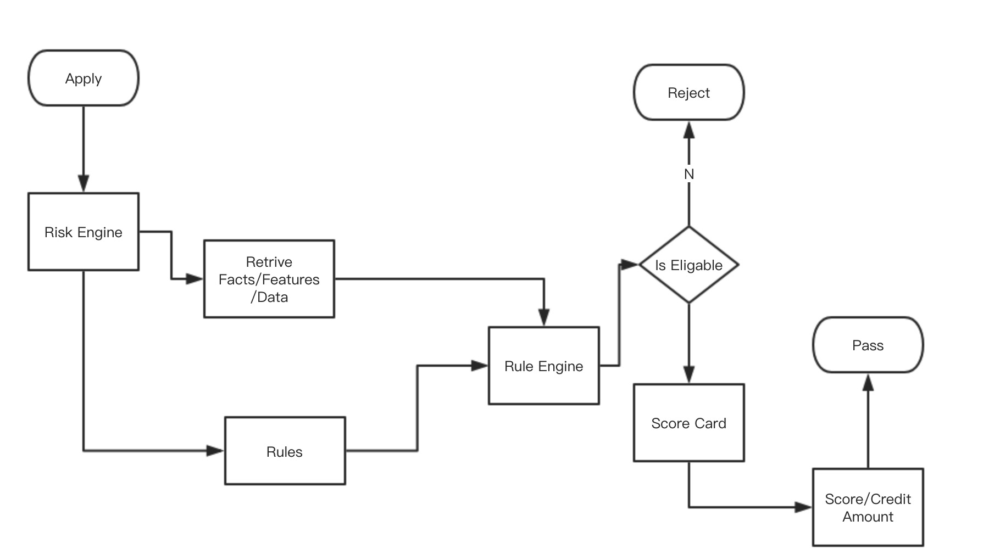
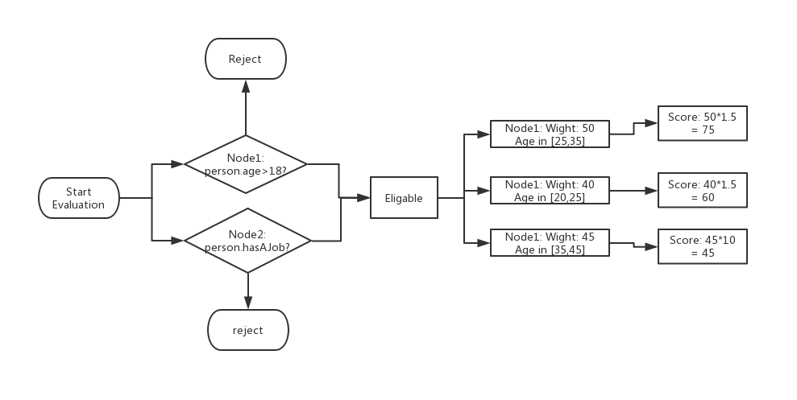
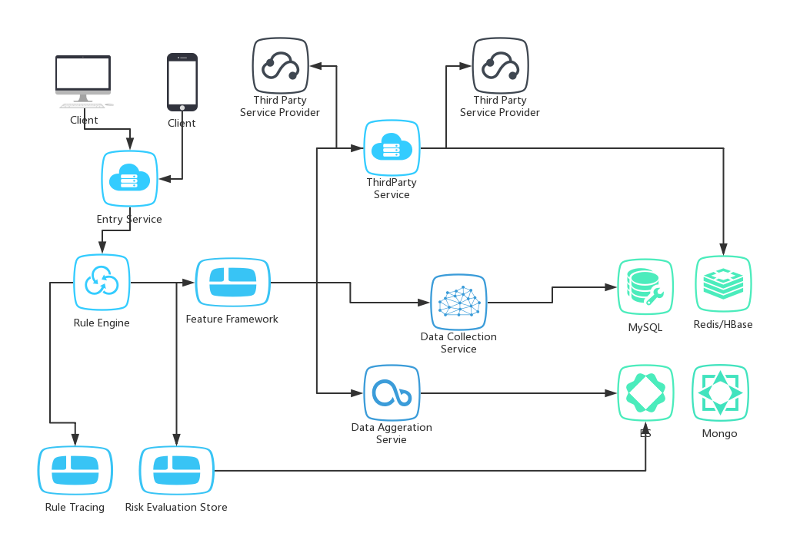
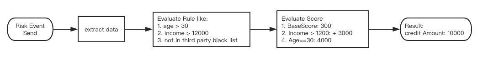
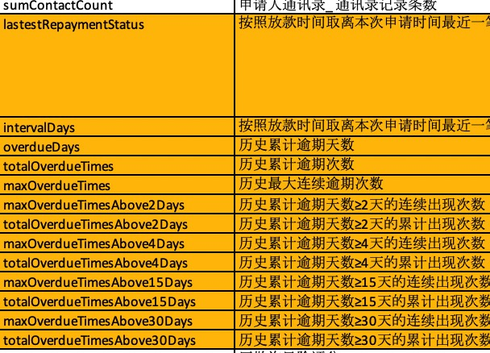

# Rule Based Risk Engine Testing Part 1- Background 

This article introduces a real world case for testing a rule based risk engine. Let me separate it into several chapters:

- System Overview to introduct the rule based risk engine
- Typical Cases
- Automate the test cases, and how ?

## 1. Rule Based Risk Engine System Overview

This is my fist risk engine project. I am not sure how other risk engine does, so I tried to introduce what I experienced, and what I had found.

Let's start with what this module does. In short, this risk engine provides a capability to rate a loan applicant from whethere he/she is eligible for a loan to how much he/she can borrow. So There are two major results:

- is eligible?
- And what the score/credit amount/terms for this applicant

And there are different products to apply, so the rule and rating system should be configurable. There are rule engine,scorecard and decision tree components to meet the configuration needs.

The whole workflow is like this:



The whole system is a decision flow, which includes 
anti-fraud rules, score-card for rating and decision tree to make a decision. If you wanto unify it, it is a decision flow, which composed by rules and decision trees.

### 1.1 A short introduce for Rule Engine

[Rule Engine](https://www.martinfowler.com/bliki/RulesEngine.html) article from Martin Flow, it abstracts that there are three conceptions:
1. Condition
2. Action
3. Chain

Basically A rule includes conditons and actions, and the chain composites these rules' conditions and actions by a runtime context.

An example in this blog for explaination:

```
if car.owner.hasCellPhone then premium += 100;
if car.model.theftRating > 4 then premium += 200;
if car.owner.livesInDodgyArea && car.model.theftRating > 2 
then premium += 300;
```

```if``` is condition, and ```then``` is action, one ```rule```
is composed by one ```if``` and one ```then```. And the chain is composed by different rules. Obviously the ```premium``` should be in the chain context in this case, because it passed through the whole rule sets.

Quite simple and easy to understand.The single rule is simple enough, the test might be undervalued. Think about if there are hundrends rules out there, test and understand the whole picture might be not easy at all. This is what Martin Flow claimed, and also he worried about the implicit rule and context in the rule engine module.

The Rule Risk Engine I meet was simillar with what mentioned in this blog. The difference is that it has wight for socre card and decision tree modules. In this system, a rule is A node which contains:

1. Expression for evaluating a result
2. A Weight for a rule
3. Composite Rule for Weight Point to make different disicion
4. Also this Node points a true or false path to go different evaluation path

But what ever these nodes contain, just think about it is a chain or composite rule. Here is a simple case to demostrate how the system works:



The output is a score. A score represents how much could be borrowed in a loan system. In this simple case, the age might be a implicit feature which should be fetched by internal api.
And the rules and score card rules are pre-defined.

So you can understand the whole module in this way:

1. Featch all relative data based the rules by the fundamental information, these relative data need to be mocked because I can't control what third party api returned as an input parameter
2. Go through all the rule nodes, evaluate the result and the score to get an conclusion which indicates is eliable for a loan, and how much could be borrowed.

So the modules should aim at how to fetch the data(facts) , and how to go through the rule engine to calculate a score. And so does this module. 

### 1.2 Rule Based Risk Engine Components

Here are components:



There are many different tech stack used, such as elastic search, mongodb, hbase, redis,spring boot, rule engine,etc. It is hard to test in my first impression, not only it is complex, but also I only had one week to understand the whole system, and I am the only person who is responsoible for testing, meanwhile there are actual 7 developers out there.

Learn it,separate the concerns, then check out what these components really do. 

- ***Third Party Service*** : Fetch Data,it calls different third party services to get some risk info then handle these to rule engine as facts(or risk feature)
- ***Data Aggeragation Service***: Fetch Data,it is simillar, aggeragating in house data to provide to rule engine as facts/risk engines
- ***Data Collection Service***: Fetch Data,simillar too, collect different in house data to provide to rule engin as facts/risk features
- ***Rule Engine***: Rules Engine,process the risk evalation to output eligable result and risk rating result
- ***Rule Tracing***: supplement component, tracing every rule evalution result for debug to error diagose
- ***Risk Evaluation Store***: supplement component,store rule evealution result
- ***rule tracing, risk result store***, these are supplement components, they may be important later but not now because this is a rule engine system for a startup department, just starting to accomulate the risk data

After dive into these components a little bit deeper, It is easy to determin that the key critical component is the Rule engine in current stage which shoule be absolutely the priority. Other components are more like data feeder and result recorder. They should be important if the volumn of users increased, and then more features need to be produced. But on current stage,it is just a MVP product which try to validate if the idea is feasible.

The more things to need to do, the more I needed to focus a critical componet. So I focused the Rule Engine first.

### 1.3 Rule Engine Typical Cases

The rule engine typical cases is that:


The things turn out that, rule engine accepts income risk input, and leverage all the different data from third party/data collection/data aggeragation services, then output the risk rating.

Let me summary it in a tester point view, rule engine's input is different data, and the output is the data calculated by the rules. If the rule composed by rules,and decision tree, the test cases covered all the node and path, then it is good to go. 

### 1.4  Test It

Let's see a test case first:

Test Case Input:

```json
{
    "riskFeatures": {
      "idNumber": "610304199801120878",
        "levelType": "10",
        "flowNo": "1506",
        "applicationId": "ac8e120c-3615-4bdb-a92d-a118e24e33da"
    }
}
```

I can change the levelType to different value, then send to risk evaluation api to get different result.
And this is typical test cases design.The tasks are for the whole Rule engin module:

1. change the risk input date
2. call risk evaluation api
3. get result and check the result

It looks very easy. The problem is how many these kind of parameters are? In a real case, 50+ parameters need to change because the third party response are aslo the input of rule engine which I can't control it only mock it as input implicit parameter, so , it is going to crazy if you create and maintain these test cases manually.
If 50 parameters, every parameters has 3 possible values, then at least there are 150 cases(doesn't consider the combination).



Manual testing is not a option under this condition if the business need to complete all the testing in one day, also it will burn me out if do these testing more than one time.

So the only option is to write code(I don't like the term automation testing, I like the term write codes for testing).

