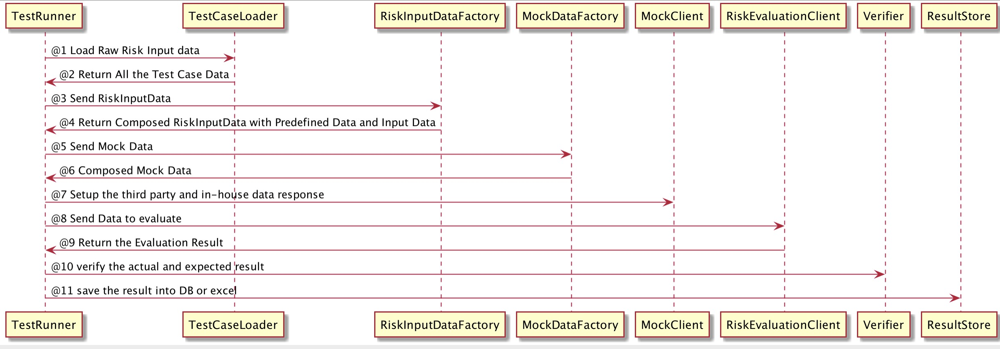

# Rule Based Risk Engine Part 2 - Write Code to Test

What to do is quite obvious:

1. Compose input data - Test Case Input
    * Fundamental Data
    * Third Party And in-house data
2. Mock the third party and in-house data according test cases
3. Call the Evaluation API to checkout if meet the expectation

And how to write code? I separate into different modules:

- TestCaseLoader: load the whole input parameters
- DataFactory: Produce different Data as input parameters
  - RiskInputDataFactory
  - MockDataFactory
  - Some Auto Generated Data Helper for testing purposes
- Clients: invoke evaluation api and mock service api
  - RiskEvaluationClient
  - MockClient
- Third Party and In-house Data Feature Manager 
  - Feature Manager
- Test Case Runner
  - TestCase Runner Template

## Implement The different Modules - TestCaseLoader

TestCaseLoader, levarage easy-poi, it helps you to read/write excel 
very quickly. For how to use easy-poi, please refer [easy-poi](http://easypoi.mydoc.io/)

## Implement The different Modules - Datafactory

All about handle data, so need some utility class, 
- IdCard Generator
- Generate IDCard through age
- Generate several ids, like request id
- Generate Times, such as creditTime

So I just write all these utilities, they are in 

## Implement The different Modules - MockDataFactory

It is very hard at the beginning,  because there is not place to indicate there third party and in-house data name, and also there is big amount of these features. 

Finally I just find out that leverage Dev's codes is the bese option. Do a quick change, and use Spring Class Scanner function do helo me a lot to achieve to mange the third part and in-houce data.

## Implement The different Modules - Clients

It is quite simple, just leverage the Okwrap client.

## Implement The different Modules - TestRunner

TestRunnerTemplate

- Before
- Run
- After

  

